# Has India's Digital Revolution Reached Everyone?
### *A Data Story on Payments, Telephones, Gender, and the Real Lines of Division Across India*

---

## 📖 Prologue: A Tea Stall, a QR Code, and a Hidden Question

Walk up to almost any roadside tea stall, grocery vendor, or auto-rickshaw in India today, and you will find a familiar sight: a black-and-white QR code glued to a metal pole or sitting inside a small speaker box that announces payments aloud.

Every headline tells us that India has undergone the fastest digital transformation in human history. Billions of transactions happen without paper money changing hands, optic fiber connects distant villages, and mobile connections count in the hundreds of millions.

**On the surface, the revolution looks complete.**

**But has this revolution truly reached everyone?**

Behind the towering national headlines and trillions of rupees, who is actively taking part, and who is standing on the outside looking in? To find out, we analyzed official data from the Reserve Bank of India (RBI), the Telecom Regulatory Authority of India (TRAI), and the nationwide National Family Health Survey (NFHS-5). 

What the data reveals is a fascinating, eye-opening story: **India's digital world is booming, but digital growth is not the same as universal digital inclusion.**

---

## Chapter 1: The Habit Breaks — How India Started Spending Digitally

For decades, cash was king in India. The monthly ritual for millions of families was simple: go to the ATM, take out physical cash, and spend it.

Around late 2022 and early 2023, however, something remarkable took place. For the first time, the steady upward march of cash withdrawals began to flatten and level off, while digital shopping and card terminals surged to record highs.

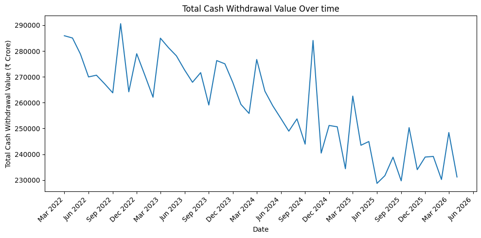

While cash withdrawals hit a plateau, spending done directly through screens and card terminals soared past **₹1,30,000 crore** every single month.

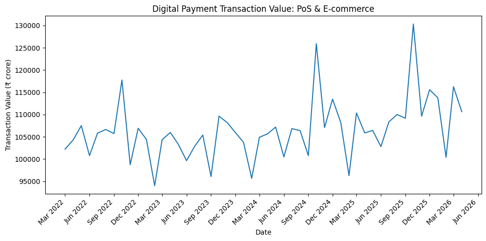

When we compare how much physical cash people withdraw for every rupee they spend digitally, the shift is undeniable. As shown below, the ratio dropped steadily over time:

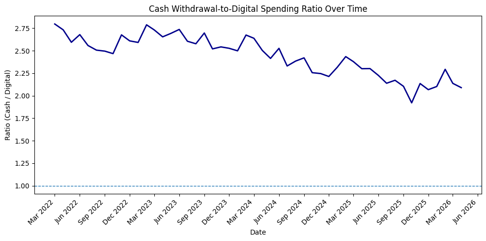

### The Paper Sticker That Beat the Expensive Machine

Why did this digital wave spread so quickly to street corners and tiny neighborhood shops? 

Traditional card swipe machines (PoS terminals) are expensive. They need electricity, maintenance, paper rolls, and merchant rental fees. A printed QR code sticker, on the other hand, costs almost nothing. As the chart below illustrates, QR codes exploded across India, growing to outnumber card swipe machines by more than **3 to 1** in just a few short years.

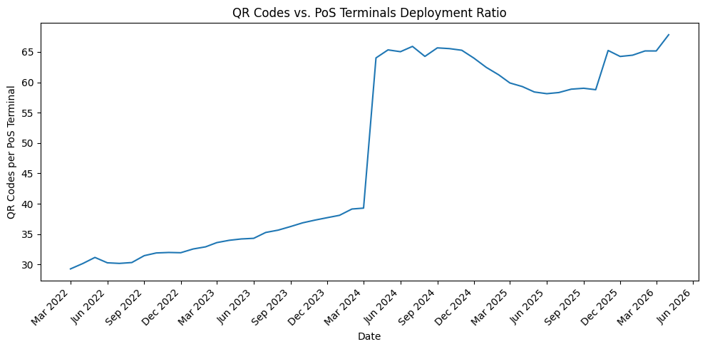

India had unquestionably built one of the most dynamic payment ecosystems in the world. But was this wave washing equally across city streets and rural farm fields?

---

## Chapter 2: The Big Number Illusion — Millions of SIM Cards, but Who Holds Them?

If you read telecom press releases, India's connectivity numbers sound staggering: well over **1.1 billion** mobile subscriptions.

It is tempting to look at a billion subscriptions and assume that almost every citizen is connected. But looking closer at rural versus urban subscriber numbers reveals a surprising demographic reality.

Nearly **65% of India's population lives in rural areas**. Yet, as the official telecom data shows, rural areas have hit an invisible glass ceiling, hovering stubbornly around **43% to 44%** of total mobile connections:

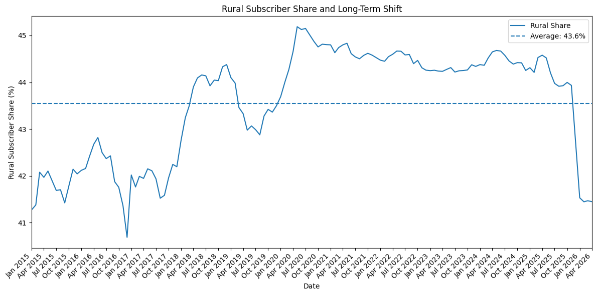

Even as the telecom network expanded year after year, the rural-to-urban split remained practically frozen:

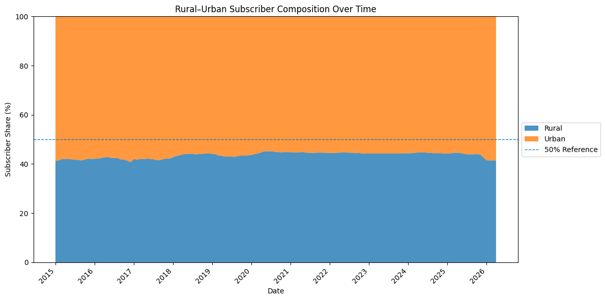

### Why doesn't the rural share grow?

Because **subscriptions are not people**.

In bustling urban hubs like Bengaluru, Mumbai, and Delhi, it is common for a single person to carry two phones or have separate SIM cards for work, home, and mobile data. These multiple SIMs inflate the total subscriber count. Meanwhile, in a rural household, three or four family members often share a single basic handset. 

The network reached the village tower, but it didn't mean every villager held a personal window to the digital world.

---

## Chapter 3: The Missing Half — Women and the Great Divide

If the divide between city and village is the first fault line, the second—and deeper—fault line is gender.

To see this clearly, we looked at state-by-state data from the National Family Health Survey. Consider two basic needs: **having a bank account** versus **using the internet**.

### The Banking Miracle: Near-Uniform Inclusion

Over the last decade, nationwide banking drives opened zero-balance accounts for hundreds of millions of citizens. When we look across almost every state in India, women's bank account ownership is high and remarkably even. In state after state, whether in the north, south, east, or west, **75% to 90% of women have their own bank account**.

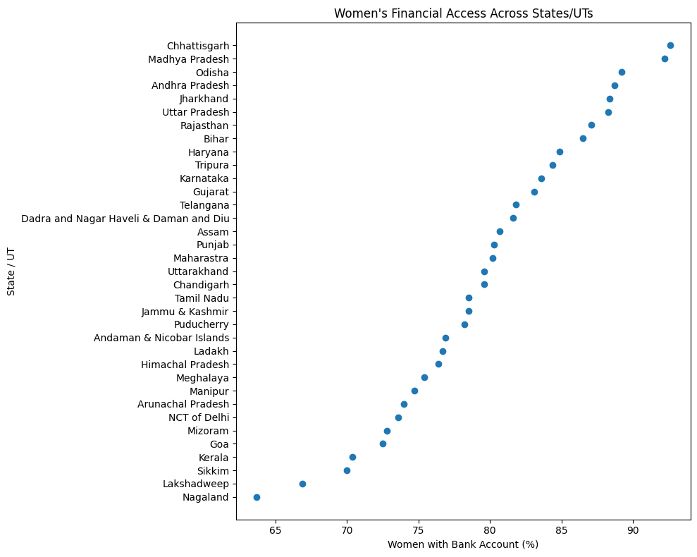

### The Internet Divide: A Wildly Uneven Map

Now look at what happens when we ask whether women in those very same states have ever used the internet. The uniformity completely vanishes:

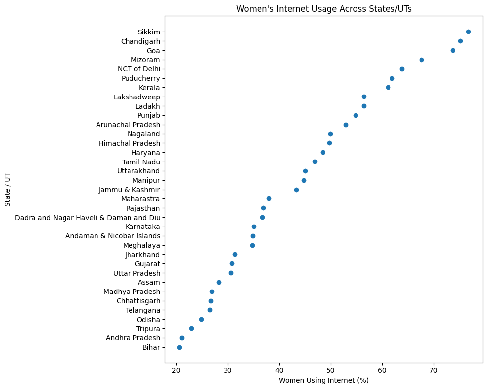

In states and territories like Goa, Sikkim, Kerala, and Chandigarh, **70% to 80%** of women use the internet. But in states like Bihar, Uttar Pradesh, and Jharkhand, that number plummets to **barely 20% to 30%**. 

### A 4x Disparity

When we measure the level of inequality across Indian states, the contrast is stark. While bank accounts are spread fairly evenly everywhere, **the interstate inequality in women's internet access is more than 4 times higher**:

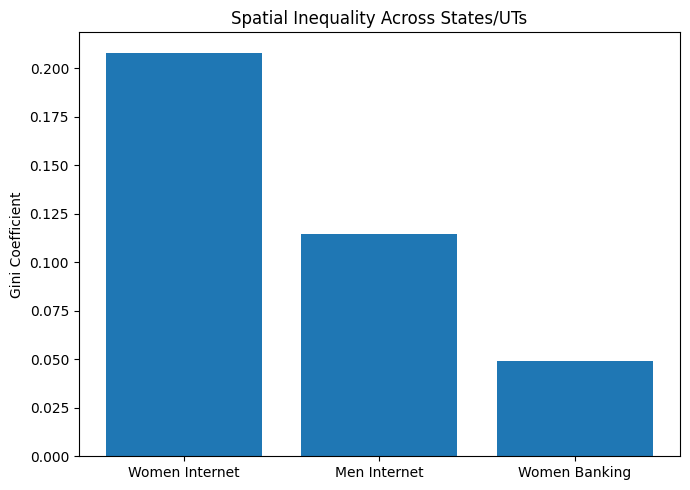

Having a bank branch in the village or a passbook in the drawer does not mean a woman is connected to the digital world.

---

## Chapter 4: The Village Penalty — When Gender Meets Geography

Does living in a village make the gender divide worse?

To answer this, we compared the difference between men's internet access and women's internet access in cities versus villages across 34 states and union territories.

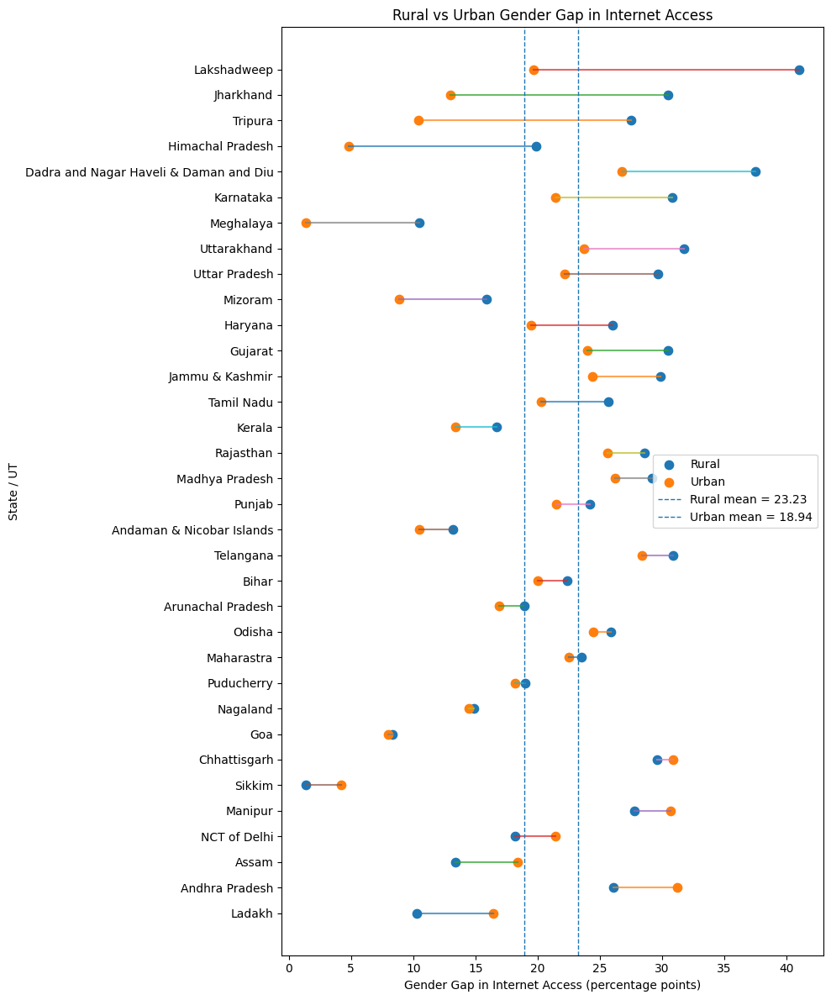

The result is clear and consistent across the country:

- In urban areas, men still lead women in internet usage by an average of about **19 percentage points**.
- In rural areas, that gap widens to over **23 percentage points**.

This is **the village penalty**: an extra hurdle of over 4 percentage points added onto rural women. In rural communities, women face a compound barrier—distance from tech infrastructure, fewer economic opportunities, and stronger traditional boundaries around technology use.

---

## Chapter 5: The Master Key — Why a Bank Account Isn't Enough

What actually unlocks the digital world for an Indian woman?

Is it having an electric connection in her home? Is it being able to read and write? Is it having a bank account? Or is it owning her own mobile phone?

To find out, we tested all four factors across every state in India:

1. **Electricity in the home:** Almost every state now has electricity in 95%+ of homes. Yet having an electric bulb in the room does not bring a woman online.
2. **Bank account ownership:** As we saw, nearly 80% of women have bank accounts, but it shows virtually no correlation with whether they use the internet. A bank account often sits dormant or is managed by a male relative.
3. **Literacy:** Reading and writing is undeniably important for life, but on its own, it doesn't guarantee digital access.
4. **Personal Mobile Phone Ownership:** **This is the single most powerful factor.**

When a woman owns her own phone, the rate of internet adoption skyrockets. If she doesn't own her phone and has to ask a father, brother, or husband for permission to make a call or look up information, the digital door stays locked.

The chart below shows the percentage of phone-owning women who actively navigate the internet across different states:

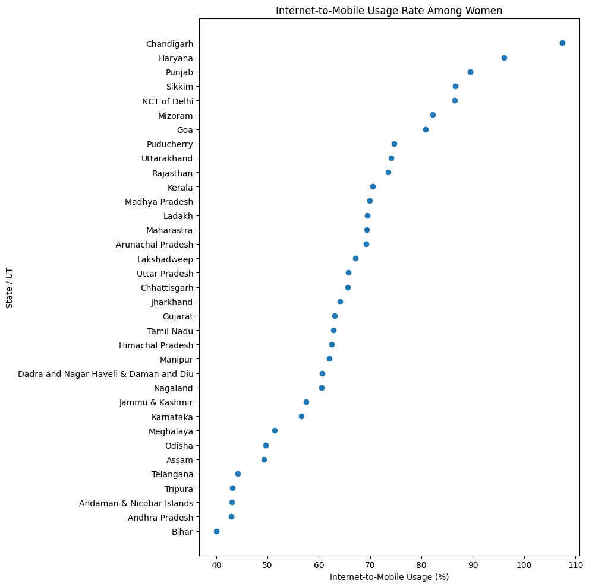

**The lesson is clear: Device custody is the true gateway to digital freedom.**

---

## Chapter 6: A Tale of Two Indias — The Split Screen

When we group India's states based on their actual digital reality, the country naturally divides into two distinct groups.

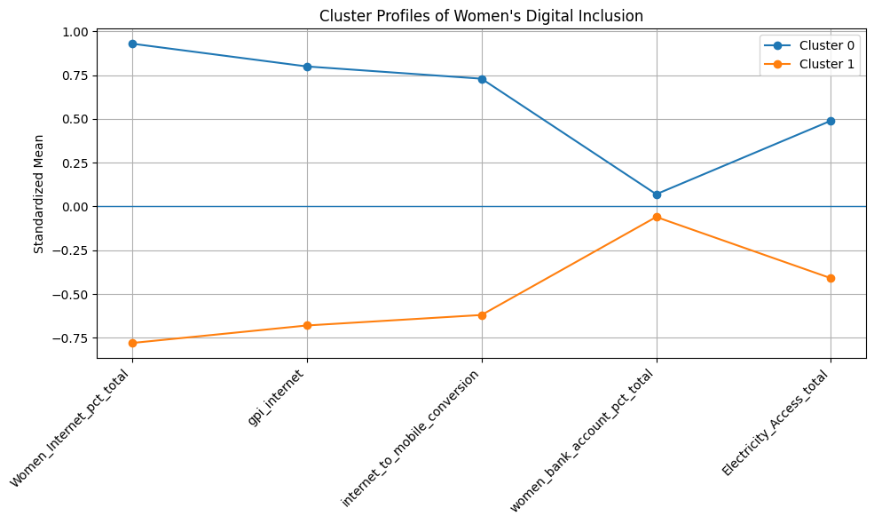

Notice how the lines behave:
- On **electricity access** and **bank account ownership**, both groups are almost identical (around 98% electricity and 80% bank accounts).
- But on **women's internet access**, **gender balance**, and **phone ownership**, the two groups pull far apart.

| What the Data Measures | Cluster 0: "The Digital Pioneers" (16 States/UTs) | Cluster 1: "The Access-Constrained" (19 States/UTs) | What It Means |
|:---|:---:|:---:|:---|
| **Women Using Internet** | **58.8%** | **31.3%** | Women in pioneer states are nearly **twice as likely** to be online. |
| **Gender Balance** | **High** (0.77 women per man) | **Low** (0.56 women per man) | A much narrower gender gap. |
| **Phone-to-Internet Use** | **77.5%** | **56.4%** | Having a phone translates directly into using the internet. |
| **Women's Bank Accounts** | **80.3%** | **79.4%** | *Virtually identical across both groups!* |
| **Electricity Access** | **99.1%** | **97.0%** | *Virtually identical across both groups!* |

### The Geographic Map

The heatmap below shows all 35 States and Union Territories organized by their cluster:

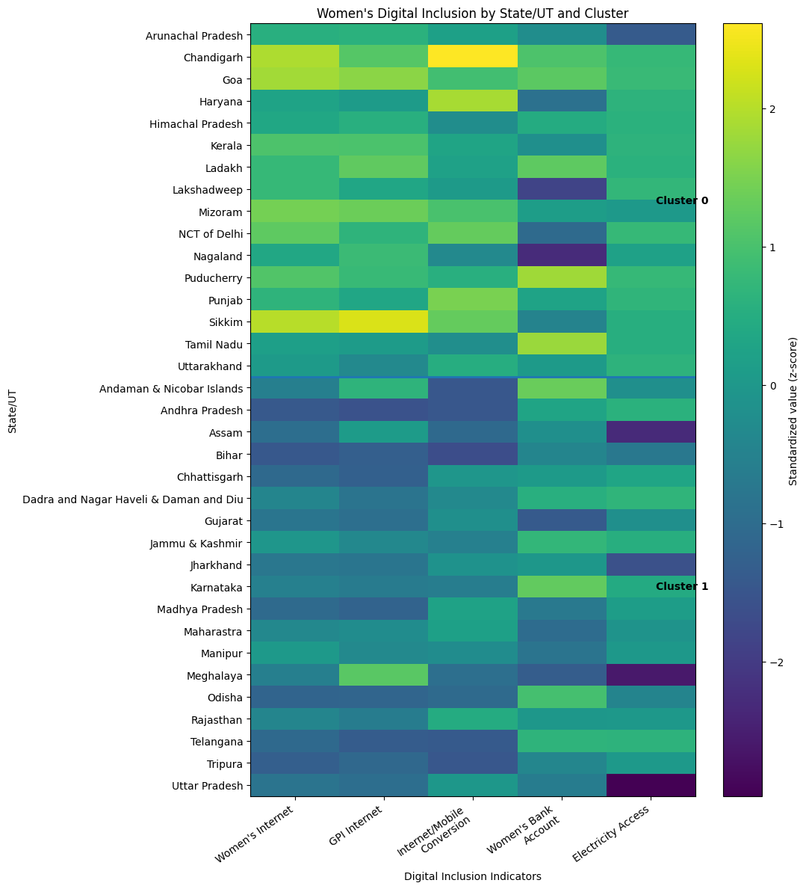

- **The Digital Pioneers (Cluster 0):**  
  *Arunachal Pradesh, Chandigarh, Goa, Haryana, Himachal Pradesh, Kerala, Ladakh, Lakshadweep, Mizoram, NCT of Delhi, Nagaland, Puducherry, Punjab, Sikkim, Tamil Nadu, Uttarakhand.*
  - In these states, women have their own phones, use the internet regularly, and participate side-by-side with men in the digital space.

- **The Access-Constrained States (Cluster 1):**  
  *Andaman & Nicobar Islands, Andhra Pradesh, Assam, Bihar, Chhattisgarh, Dadra & Nagar Haveli and Daman & Diu, Gujarat, Jammu & Kashmir, Jharkhand, Karnataka, Madhya Pradesh, Maharashtra, Manipur, Meghalaya, Odisha, Rajasthan, Telangana, Tripura, Uttar Pradesh, West Bengal.*
  - These states contain the vast majority of India's population. They have electric power grids and bank accounts, but millions of women remain locked out of independent digital participation.

---

## 🎯 Epilogue: What Does This Mean for India's Future?

India's digital transformation is an extraordinary achievement. Payments are frictionless, telecom towers reach remote hills, and foundational infrastructure is in place.

**But building the road does not mean everyone has a car.**

Our findings show that:
1. **Headline growth masks deep gaps.** A billion mobile subscriptions does not mean a billion connected citizens.
2. **Foundational inclusion isn't digital inclusion.** Giving someone a bank account or a power plug does not automatically grant them digital access.
3. **Personal phone ownership is the missing key.** If a woman does not own her own device, she cannot safely learn, work, or transact online.
4. **Rural women need targeted attention.** The intersection of village geography and social dynamics creates a double penalty that broad national policies alone cannot fix.

True digital revolution is not just measured in trillions of rupees processed or millions of SIM cards activated. **It is measured by whether an ordinary woman in a rural village can pick up a device of her own, connect to the world, and participate on equal terms.**

---

## 💻 Project Architecture & How to Explore

For data scientists, researchers, and developers who wish to explore the data and verify every calculation, the entire workflow is documented across 4 self-contained Jupyter notebooks:

```
notebooks/
│
├── 01_data_cleaning.ipynb
│   └── Ingests and cleans official datasets from RBI, TRAI, and NFHS-5; handles missing values and formats.
│
├── 02_Metric_Formulation_and_Feature_Engineering.ipynb
│   └── Derives key measures: cash-to-digital spending ratio, telecom equity, gender parity, and state inequality.
│
├── 03_Gender_Parity_Hypothesis_and_Driver_Analysis.ipynb
│   └── Tests the rural-urban gap, checks turning points in cash habits, and identifies what predicts women's internet access.
│
└── 04_state_level_digital_inclusion_segmentation.ipynb
    └── Groups India's 35 states into distinct digital inclusion profiles using multi-factor clustering.
```

### 📂 Datasets Used

| Dataset | Source | What It Covers |
|:---|:---|:---|
| **Monthly Payment Data** | [Reserve Bank of India (RBI)](https://rbi.org.in/) | ATM cash withdrawals, card swipe machines, and online spending trends (2022–2026). |
| **Telecom Subscriptions** | [Telecom Regulatory Authority of India (TRAI)](https://www.trai.gov.in/) | Monthly rural vs. urban mobile and landline subscription numbers. |
| **National Family Health Survey** | [NFHS-5 Factsheets (MoHFW / Data.gov.in)](https://www.data.gov.in/) | State-by-state measures on women's internet access, phone ownership, bank accounts, and literacy. |
| **Merchant QR Connections** | Project Dataset | Growth of QR payment touchpoints across India. |

---

## 🚀 Quickstart: Running the Analysis Locally

### 1. Clone the Repository
```bash
git clone https://github.com/your-username/indian-digital-revolution.git
cd indian-digital-revolution
```

### 2. Set Up a Python Environment
```bash
python -m venv .venv

# On Windows:
.venv\Scripts\activate

# On macOS/Linux:
source .venv/bin/activate
```

### 3. Install Dependencies
```bash
pip install -r requirements.txt
```

### 4. Launch the Notebooks
```bash
jupyter notebook notebooks/
```

---

## 📜 License & Citation

This project is open-source under the [MIT License](LICENSE).  
Feel free to use the insights, charts, and analysis in your research, reporting, or public policy discussions.
