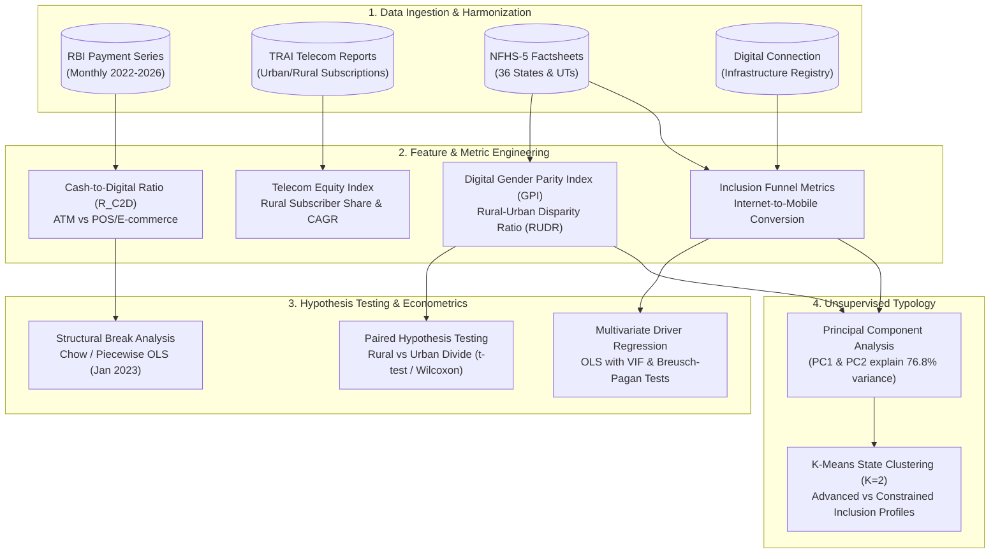

# Has India's Digital Revolution Reached Everyone?
### *An Empirical Investigation into Payment Trajectories, Telecom Penetration, Gender Parity, and State-Level Disparities*

[](https://www.python.org/)
[](#data-architecture--sources)
[](#analytical-pipeline)

---

## 🎯 Executive Takeaway

> **Central Finding:** **Digital expansion is not synonymous with universal digital inclusion.**  
> While national payment and telecom systems have scaled exponentially, digital participation remains deeply asymmetric. While foundational infrastructure (electricity > 98%) and financial inclusion (women's bank accounts ~ 80%) show near-uniform national distribution, **active digital access diverges starkly along regional and gender lines**.

```
                           THE DIGITAL INCLUSION PARADOX
                      
   National Enablers (Uniform)                Active Digital Inclusion (Divergent)
┌──────────────────────────────────────┐     ┌──────────────────────────────────────┐
│  Women's Bank Accounts : 79.8% avg   │     │  Women's Internet Use  : 43.8% avg   │
│  State Gini Coeff      : 0.049 (Low) │ vs  │  State Gini Coeff      : 0.208 (4x!) │
│  Cluster 0 vs 1 Delta  : +0.88 pp    │     │  Cluster 0 vs 1 Delta  : +27.48 pp   │
└──────────────────────────────────────┘     └──────────────────────────────────────┘
```

---

## 📊 Key Findings Scorecard

| Analytical Domain | Primary Metric / Test | Empirical Result | Statistical Significance | Core Takeaway |
|:---|:---|:---|:---|:---|
| **Payment Dynamics** | Cash-to-Digital Reliance ($R_{C2D}$) | Structural shift in **Jan 2023** | Chow Test: $F = 14.71, p < 0.001$ | Long-term moderation in ATM cash withdrawal growth as digital POS/e-commerce climbed past ₹1.3 lakh Cr. |
| **Telecom Distribution** | Rural Subscriber Share | Plateaued at **~43.6%** (40.7% – 45.2%) | Time-series bounded range | Telecom growth reflects multiple SIM saturation rather than proportional expansion to rural populations (~65% of India). |
| **Spatial Inequality** | Cross-State Gini Coefficient | Women's Internet: **0.2082**<br>Bank Accounts: **0.0493** | Ratio: **4.22x higher inequality** | Digital connectivity is over 4× more geographically concentrated than financial inclusion. |
| **Gender & Geography** | Paired Rural vs. Urban Gender Gap | Rural: **23.23 pp**<br>Urban: **18.94 pp** | Paired $t(33) = 3.79, p < 0.001$<br>Wilcoxon $p < 0.001$ | Rural women face a compounded penalty: the digital gender divide is **4.29 pp wider** in rural areas. |
| **Driver Econometrics** | OLS: Women's Internet Penetration | $R^2 = 0.676$, Adj. $R^2 = 0.632$ | Model $F(4, 30) = 15.62, p < 0.001$ | **Personal device ownership** ($\beta = 0.589, p = 0.0017$) is the single dominant predictor over literacy or banking. |
| **State Segmentation** | K-Means Clustering ($K=2$) | **Cluster 0** (16 states) vs<br>**Cluster 1** (19 states) | Silhouette: **0.307**<br>Calinski-Harabasz: **20.69** | Direct digital access splits the country in half; basic enablers (banking/power) show virtually no separation. |

---

## 🔄 Analytical Pipeline



---

## 🔍 Detailed Analytical Findings

### 1. Macro Payment Trajectory: The 2023 Inflection Point (RBI)
Analysis of Reserve Bank of India (RBI) transaction records examines the substitution curve between physical cash withdrawals (ATM) and merchant digital spending (PoS & E-commerce).

- **Digital Escalation:** Card PoS and e-commerce spend climbed steadily from ~₹102,000 Crore to peaks exceeding **₹130,000 Crore**.
- **The Cash-to-Digital Reliance Ratio ($R_{C2D}$):**
  $$\text{Reliance Ratio } (R_{C2D}) = \frac{\text{Total Cash Withdrawal Value}}{\text{Total Digital PoS \& E-Commerce Spend}}$$
- **Structural Break Confirmation (January 2023):**  
  A piecewise regression and Chow test identified **January 2023** as a statistically validated regime shift:
  - **Chow F-Statistic:** $14.71$ ($p < 0.0001$)
  - **Interpretation:** The trend of $R_{C2D}$ moderated significantly post-break. While cash usage remains elevated in absolute terms, digital merchant volume has decoupled from historical ratios.

---

### 2. Telecom Expansion: The Rural Ceiling (TRAI)
Examining monthly Telecom Regulatory Authority of India (TRAI) wireline and wireless subscriber records:

```
RURAL SUBSCRIBER SHARE OVER TIME:
  40%         42%         44%         46%         48%         50%
  ├───────────┼───────────┼───────────┼───────────┼───────────┤
  ████████████████████████▌  ~43.6% Long-Term Mean
  [Range: 40.7% ─────── 45.2%]
  
  Demographic Reality: ~65% of Indian population resides in rural areas
```
- **The Subscription vs. Person Gap:** Rural subscriber share has hovered strictly between **40.7% and 45.2%**, averaging **43.6%**.
- **Methodological Insight:** High gross subscription numbers mask individual exclusion. Multiple SIM ownership in urban circles inflates macro penetration while rural per-capita user adoption remains constrained.

---

### 3. Spatial Inequality & The Compounded Gender Penalty (NFHS-5)

#### A. Spatial Inequality Disparity (Gini Coefficients)
Measuring inequality across 36 States and Union Territories reveals that digital opportunity is substantially more unevenly spread than physical or financial infrastructure:

```
CROSS-STATE GINI COEFFICIENT (Between-State Inequality):
Indicator                        Gini Coeff      Visual
────────────────────────────────────────────────────────────────────────
Women's Bank Account Ownership   0.0493          ███░░░░░░░░░░░░░  (Low inequality)
Men's Internet Access            0.1147          ███████░░░░░░░░░  (Moderate)
Women's Internet Access          0.2082          █████████████░░░  (4.2x higher than banking!)
```

#### B. The Compounded Rural Gender Gap
Does living in a rural area widen the gender gap in internet adoption? We conducted paired statistical tests across the 34 States/UTs with complete rural/urban splits:

$$\text{Gender Gap} = \text{Male Internet Penetration (\%)} - \text{Female Internet Penetration (\%)} $$

```
URBAN VS. RURAL GENDER DIVIDE (34 States/UTs Paired):
Urban Gender Gap :  ████████████░░░░░░░░  18.94 pp
Rural Gender Gap :  ███████████████░░░░░  23.23 pp  (+4.29 pp gap penalty)
```

- **Paired $t$-test:** $t(33) = 3.791$, $p = 0.0006$
- **Wilcoxon Signed-Rank Test:** $W = 62.0$, $p = 0.000998$
- **95% Confidence Interval of Difference:** $[+1.99 \text{ pp}, +6.59 \text{ pp}]$
- **Conclusion:** Rural women face a statistically verified double divide—the disparity between men and women is significantly larger in rural districts than in urban centers.

---

### 4. Econometric Drivers of Women's Internet Penetration (OLS)

To investigate what structural factors predict state-level female internet access, we estimated an ordinary least squares (OLS) model ($N = 35$ States/UTs):

$$\text{Women's Internet \%} = \beta_0 + \beta_1(\text{Mobile}) + \beta_2(\text{Literacy}) + \beta_3(\text{Banking}) + \beta_4(\text{Electricity}) + \epsilon$$

#### Regression Results Table:
| Predictor Variable | Raw Coeff ($b$) | Std. Error | $t$-value | $p$-value | Std. Beta ($\beta$) | Significance |
|:---|:---:|:---:|:---:|:---:|:---:|:---:|
| **Intercept** | -135.43 | 71.96 | -1.882 | 0.070 | — | |
| **Women's Mobile Ownership (%)** | **+0.6319** | **0.183** | **+3.457** | **0.0017** | **+0.589** | ⭐️⭐️ ($p < 0.01$) |
| **Female Literacy Rate (%)** | +0.3265 | 0.287 | +1.138 | 0.264 | +0.196 | Not sig ($p > 0.05$) |
| **Electricity Access (%)** | +1.2021 | 0.801 | +1.502 | 0.144 | +0.175 | Not sig ($p > 0.05$) |
| **Women's Bank Account (%)** | -0.0777 | 0.267 | -0.290 | 0.774 | -0.034 | Not sig ($p > 0.05$) |

```
MODEL FIT & SPECIFICATION DIAGNOSTICS:
┌──────────────────────────────────────┬──────────────────────────────────────┐
│  R-squared          : 0.676          │  Durbin-Watson Stat : 2.061          │
│  Adjusted R-squared : 0.632          │  Breusch-Pagan Test : p = 0.786      │
│  F-Statistic (4, 30): 15.62 (p < 0.001) Multi-Collinearity: All VIFs < 5   │
└──────────────────────────────────────┴──────────────────────────────────────┘
```

> **Key Insight:** Mobile ownership is the **only statistically significant independent driver** ($\beta = 0.589, p = 0.0017$). Having an electricity connection or a bank account does not automatically translate into female internet usage without independent device custody.

---

### 5. State Typologies: Two Indias in Digital Inclusion (PCA + K-Means)

Unsupervised dimensionality reduction (PCA) indicates that the first two components explain **76.80% of the total variance** across digital, demographic, and financial metrics:
- **PC1 (53.4%):** Captures the **Direct Access & Gender Parity Axis** (Mobile ownership, Internet access, GPI).
- **PC2 (23.4%):** Captures the **Foundational Enablement Axis** (Banking inclusion, physical connectivity).

Applying K-Means clustering ($K=2$, optimal silhouette score $= 0.3069$, Calinski-Harabasz $= 20.69$) segments India into two distinct operational profiles:

```
                      CLUSTER PROFILE COMPARISON (K=2)
                      
   Indicator                         Cluster 0 (Advanced)    Cluster 1 (Constrained)   Delta
   ─────────────────────────────────────────────────────────────────────────────────────────
   Women's Internet Access           ███████████▌ 58.78%     ██████░░░░░░ 31.30%       +27.48 pp
   Gender Parity Index (GPI)         ████████████  0.767     ████████░░░░  0.559       +0.208
   Internet-to-Mobile Conversion     ████████████ 77.50%     █████████░░░ 56.42%       +21.08 pp
   Women's Bank Account Ownership    ████████████ 80.25%     ████████████ 79.37%       +0.88 pp
   Electricity Access                ████████████ 99.10%     ███████████░ 97.00%       +2.10 pp
```

#### Geographic Allocation of States:
- **Cluster 0 — High Inclusion & Parity (16 States/UTs):**  
  *Arunachal Pradesh, Chandigarh, Goa, Haryana, Himachal Pradesh, Kerala, Ladakh, Lakshadweep, Mizoram, NCT of Delhi, Nagaland, Puducherry, Punjab, Sikkim, Tamil Nadu, Uttarakhand.*
- **Cluster 1 — Infrastructure-Rich, Access-Constrained (19 States/UTs):**  
  *Andaman & Nicobar Islands, Andhra Pradesh, Assam, Bihar, Chhattisgarh, Dadra & Nagar Haveli and Daman & Diu, Gujarat, Jammu & Kashmir, Jharkhand, Karnataka, Madhya Pradesh, Maharashtra, Manipur, Meghalaya, Odisha, Rajasthan, Telangana, Tripura, Uttar Pradesh, West Bengal.*

---

## 🗂️ Notebook Architecture & Execution Guide

The analysis is structured sequentially across 4 standalone, reproducible notebooks in [`notebooks/`](file:///D:/Christ/Proj/1.%20Indian%20Digital%20Revolution/notebooks):

```
notebooks/
│
├── 01_data_cleaning.ipynb
│   └── Ingests raw RBI, TRAI, NFHS-5, and connection records; performs schema standardizations,
│       datetime formatting, and integrity validation (Urban + Rural = Total).
│
├── 02_Metric_Formulation_and_Feature_Engineering.ipynb
│   └── Derives macro payment indices (R_C2D, Ticket sizes), telecom rural metrics,
│       Gender Parity Index (GPI), Rural-Urban Disparity Ratio (RUDR), and Inclusion Funnels.
│
├── 03_Gender_Parity_Hypothesis_and_Driver_Analysis.ipynb
│   └── Executes Chow structural break tests, paired rural vs. urban hypothesis tests
│       (t-test & Wilcoxon), cross-state Gini calculations, and OLS driver regressions with diagnostics.
│
└── 04_state_level_digital_inclusion_segmentation.ipynb
    └── Performs standard scaling, Principal Component Analysis (scree & biplots), K-means clustering,
        silhouette evaluation, and state typology profiling.
```

---

## 🚀 Environment Setup & Reproduction

### Prerequisites
- Python 3.10 or higher

### 1. Clone & Set Up Virtual Environment
```bash
# Clone the repository
git clone https://github.com/your-username/indian-digital-revolution.git
cd indian-digital-revolution

# Create and activate virtual environment
python -m venv .venv
# On Windows:
.venv\Scripts\activate
# On Linux/macOS:
source .venv/bin/activate
```

### 2. Install Dependencies
```bash
pip install -r requirements.txt
```

### 3. Launch Notebooks
```bash
jupyter notebook notebooks/
```

---

## 📦 Data Dictionary

| Folder | File | Primary Dimensions / Description | Source |
|:---|:---|:---|:---|
| `dataset/raw/` | `RBI_data.xlsx` | Monthly volume and value across ATMs, POS machines, and E-commerce. | Reserve Bank of India (RBI) |
| `dataset/raw/` | `telecom_subscription.csv` | Monthly urban and rural wireline and wireless subscriber counts. | TRAI |
| `dataset/raw/` | `datafile.csv` | NFHS-5 state-wise factsheets across literacy, internet, phone, and banking. | MoHFW / Data.gov.in |
| `dataset/raw/` | `connection.csv` | State-level merchant QR and digital payment connection points. | Project Archive |
| `dataset/clean/`| `rbi.csv`, `telecom_sub.csv`, `nfhs.csv`, `connection.csv` | Cleaned, pivoted, and harmonized tables ready for modeling. | Processed via `01_data_cleaning.ipynb` |

---

## ⚖️ Methodological Scope & Limitations

1. **Macro vs. Individual Resolution:** State-level regressions and Gini coefficients measure spatial inequality across administrative units, not micro-inequality across individual households.
2. **Subscription Multiplicity:** TRAI subscriber metrics track active SIM cards; due to dual-SIM usage, subscription counts exceed the number of unique individuals.
3. **Card vs. UPI Transaction Scope:** The RBI payment series utilized in the time-series model specifically tracks debit/credit ATM withdrawals versus card POS and e-commerce streams, serving as a validated proxy rather than an exhaustive ledger of all UPI P2P transfers.
4. **Cross-Sectional Inference:** The OLS driver model establishes empirical association rather than verified direct causation.
